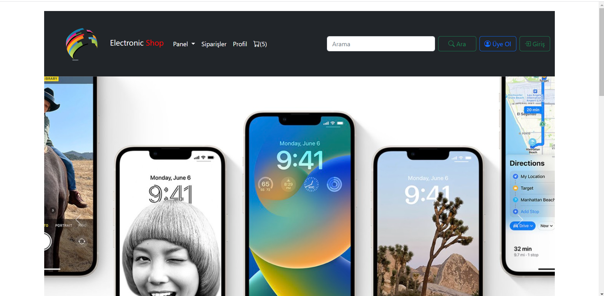
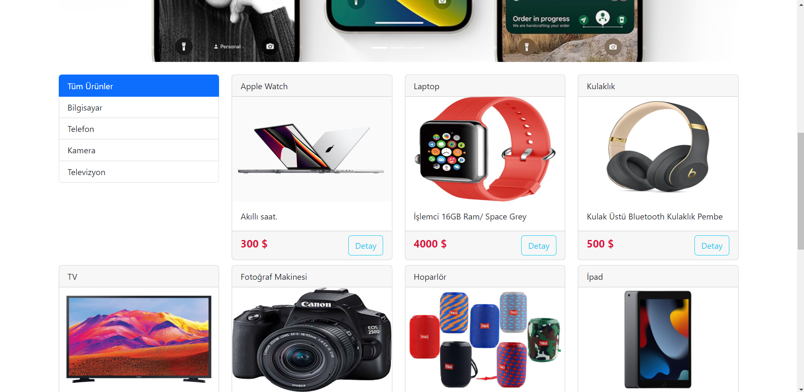
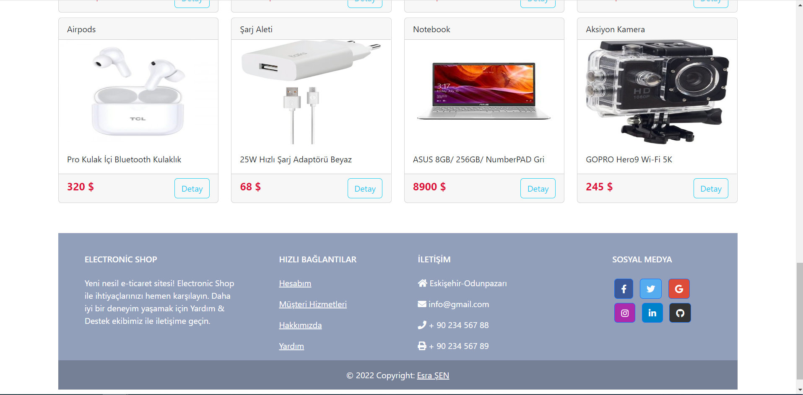
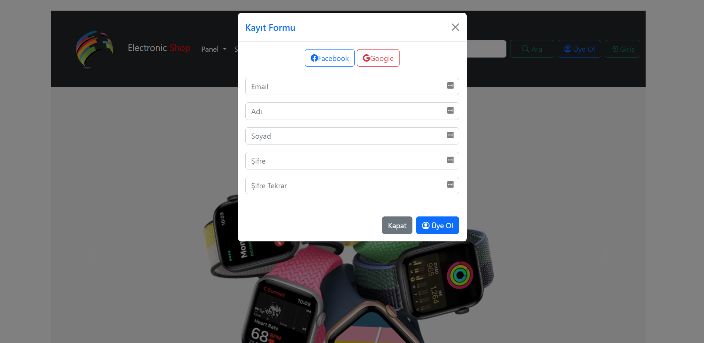
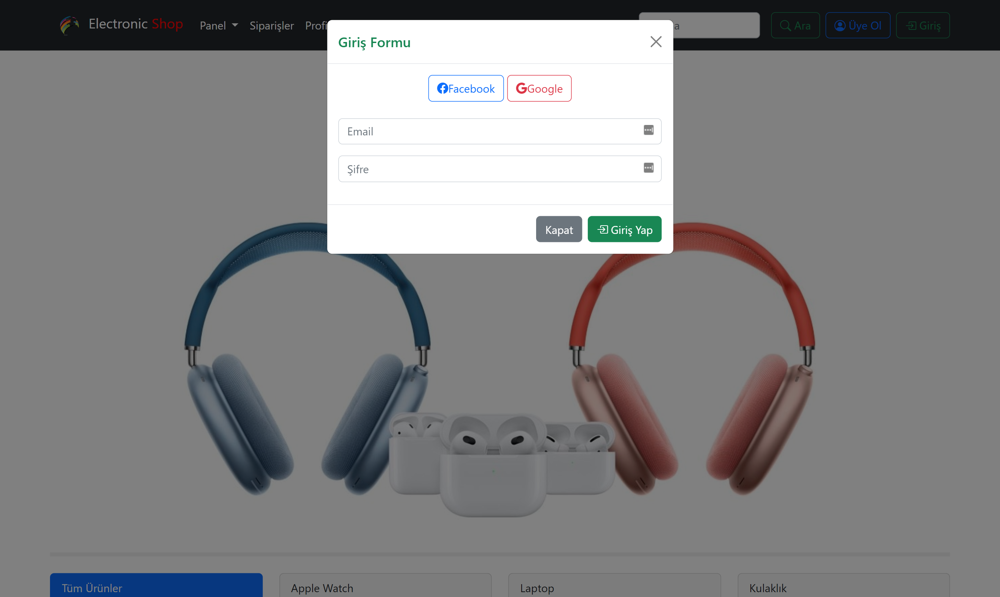

<h1 align="center">Sebit-Bootcamp 3.Ödev </h1>
<h3 align="center"> E-Commerce Web Site Design(Electronic Shop) </h3>  

 

<b>3.Ödev Web Sitesi Production:</b> <a href="https://sebit-bootcamp.tk/odev3/">https://sebit-bootcamp.tk/odev3/</a>  
<b>Tüm Projeler Production:</b> <a href="https://sebit-bootcamp.tk">https://sebit-bootcamp.tk</a> 

<!-- ABOUT THE HOMEWORK -->
<h2 id="hakkinda"> :pencil: Ödev Konusu</h2>

 
<b>Ödev Konusu:</b> 
Bootstrap 5 ile web sitesi tasarımı yapılması  
<b>Gereksinimler:</b> 
<b>Frontend:</b> 
●Bootstrap 5.2 

<!-- PREREQUISITES -->
<h2 id="teknolojiler"> :fork_and_knife: Kullanılan Teknolojiler</h2>

  

<!-- ROADMAP -->
<h2 id="ss"> :dart: Ekran Görüntüleri</h2>

 
Web Slider görünüm:

  

 

 
Web Content görünüm:

  

 

 
Web Footer görünüm:

  

 

 
Web Kayıt Ol Modal görünüm:

  

 

 
Web Giriş Yap Modal görünüm:

  

 

<h2 id="iletisim"> :scroll: İletişim ve Bilgiler</h2>

✤ <a href="https://github.com/esrasen">GitHub</a>  
