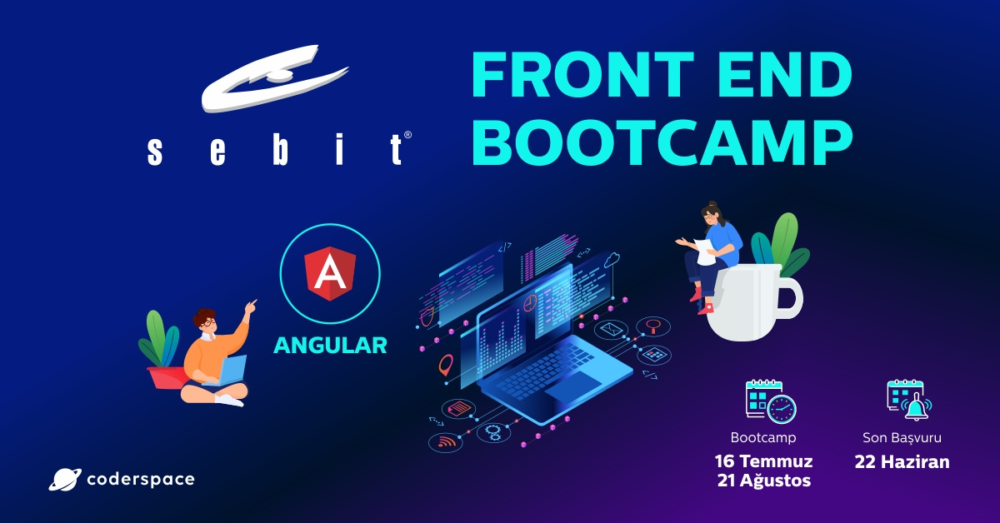

 
  
    

<h1 align="center"> Sebit Front End Bootcamp </h1>
<h3 align="center"> Genel İçerik </h3>

 

 
  

<!-- TABLE OF CONTENTS -->
<h2 id="table-of-contents"> :book: İçerik</h2>

  
İçerik

  <ol>
    <li><a href="#hakkinda"> ➤ Repo Hakkında</a></li>
    <li><a href="#teknolojiler"> ➤ Kullanılan Teknolojiler</a></li>
    <li>
      <a href="#hw"> ➤ Ödevler</a>
      <ul>
        <li><a href="#hw-1">1.Ödev</a></li>
        <li><a href="#hw-2">2.Ödev Navbar</a></li>
        <li><a href="#hw-3">3.Ödev Website</a></li>
      </ul>
    </li>
    <li>
      <a href="#dy1"> ➤ 1.Hafta/1</a>
      <ul>
        <li><a href="#dy1-1">Html</a></li>
        <li><a href="#dy1-2">Css</a></li>
      </ul>
    </li>
    <li>
      <a href="#dy2"> ➤ 1.Hafta/2</a>
      <ul>
        <li><a href="#dy2-1">Css-Mix</a></li>
        <li><a href="#dy2-2">Css-Position</a></li>
      </ul>
    </li>
    <li>
      <a href="#dy3"> ➤ 2.Hafta/1</a>
      <ul>
        <li><a href="#dy3-1">Bootstrap</a></li>
        <li><a href="#dy3-2">Burger</a></li>
        <li><a href="#dy3-3">Burger-Bootstrap</a></li>
      </ul>
    </li>
    <li>
      <a href="#dy4"> ➤ 2.Hafta/2</a>
      <ul>
        <li><a href="#dy4-1">Js</a></li>
        <li><a href="#dy4-2">Js-DOM</a></li>
        <li><a href="#dy4-3">Js-String</a></li>
        <li><a href="#dy4-4">Js-Number</a></li>
        <li><a href="#dy4-5">Js-Template-String</a></li>
        <li><a href="#dy4-6">Array</a></li>
        <li><a href="#dy4-7">Boolean</a></li>
        <li><a href="#dy4-8">Type ve Karşılaştırma</a></li>
        <li><a href="#dy4-9">For</a></li>
        <li><a href="#dy4-10">While</a></li>
        <li><a href="#dy4-11">If</a></li>
        <li><a href="#dy4-12">Break-Continue</a></li>
        <li><a href="#dy4-13">Switch</a></li>
        <li><a href="#dy4-14">Global-Local</a></li>
        <li><a href="#dy4-15">Function</a></li>
      </ul>
    </li>
    <li><a href="#iletisim"> ➤ İletişim ve Bilgiler</a></li>
  </ol>

<b>Tüm Projeler Production:</b> <a href="https://sebit-bootcamp.tk">https://sebit-bootcamp.tk</a> 

<!-- ABOUT THE HOMEWORK -->
<h2 id="hakkinda"> :pencil: Repo Hakkında</h2>

 
<b>Bootcamp:</b> 
Coderspace ve Sebit Eğitim ve Bilgi Teknolojileri tarafından düzenlenen Frontend Bootcamp eğitim kaynağıdır.  

<!-- PREREQUISITES -->
<h2 id="teknolojiler"> :fork_and_knife: Kullanılan Teknolojiler</h2>

  
  
  
  

<!--  -->
<h2 id="hw"> :hammer: Ödevler</h2>

 
Bootcamp boyunca verilen tüm ödevler.

<b><a href="https://github.com/esrasen/Sebit-Bootcamp/tree/main/Homeworks/1-Homework">✤ 1.Ödev</a></b> 
<b><a href="https://github.com/esrasen/Sebit-Bootcamp/tree/main/Homeworks/2-Bootstrap-Navbar">✤ 2.Ödev Navbar</a></b> 
<b><a href="https://github.com/esrasen/Sebit-Bootcamp/tree/main/Homeworks/3-Website">✤ 3.Ödev Website</a></b> 

<h2 id="dy-1"> :hammer: Haftalar</h2>

 
Bootcamp boyunca her hafta yapılan çalışmalar.

 <b>1.Hafta/1:</b> 
<b><a href="https://github.com/esrasen/Sebit-Bootcamp/tree/main/Week-1-Html/1-Html">✤ Html</a></b> 
<b><a href="https://github.com/esrasen/Sebit-Bootcamp/tree/main/Week-1-Html/2-Css">✤ Css</a></b> 

 <b>1.Hafta/2:</b> 
<b><a href="https://github.com/esrasen/Sebit-Bootcamp/tree/main/Week-1-Css/3-Mix">✤ Css-Mix</a></b> 
<b><a href="https://github.com/esrasen/Sebit-Bootcamp/tree/main/Week-1-Css/4-Position">✤ Css-Position</a></b> 

 <b>2.Hafta/1:</b> 
<b><a href="https://github.com/esrasen/Sebit-Bootcamp/tree/main/Week-2-Bootstrap/Bootstrap">✤ Bootstrap</a></b> 
<b><a href="https://github.com/esrasen/Sebit-Bootcamp/tree/main/Week-2-Bootstrap/Burger">✤ Burger</a></b> 
<b><a href="https://github.com/esrasen/Sebit-Bootcamp/tree/main/Week-2-Bootstrap/Burger-Bootstrap">✤ Burger-Bootstrap</a></b> 

 <b>2.Hafta/2:</b> 
<b><a href="https://github.com/esrasen/Sebit-Bootcamp/tree/main/Week-2-Js/9-Js">✤ Js</a></b> 
<b><a href="https://github.com/esrasen/Sebit-Bootcamp/tree/main/Week-2-Js/9-Js-DOM">✤ Js-DOM</a></b> 
<b><a href="https://github.com/esrasen/Sebit-Bootcamp/tree/main/Week-2-Js/10-Js-String">✤ Js-String</a></b> 
<b><a href="https://github.com/esrasen/Sebit-Bootcamp/tree/main/Week-2-Js/11-Js-Number">✤ Js-Number</a></b> 
<b><a href="https://github.com/esrasen/Sebit-Bootcamp/tree/main/Week-2-Js/11-Js-Template-String">✤ Js-Template-String</a></b> 
<b><a href="https://github.com/esrasen/Sebit-Bootcamp/tree/main/Week-2-Js/12-Array">✤ Array</a></b> 
<b><a href="https://github.com/esrasen/Sebit-Bootcamp/tree/main/Week-2-Js/13-Boolean">✤ Boolean</a></b> 
<b><a href="https://github.com/esrasen/Sebit-Bootcamp/tree/main/Week-2-Js/14-TypeveKarsilastirma">✤ Type ve Karşılaştırma</a></b> 
<b><a href="https://github.com/esrasen/Sebit-Bootcamp/tree/main/Week-2-Js/15-For">✤ For</a></b> 
<b><a href="https://github.com/esrasen/Sebit-Bootcamp/tree/main/Week-2-Js/15-While">✤ While</a></b> 
<b><a href="https://github.com/esrasen/Sebit-Bootcamp/tree/main/Week-2-Js/17-If">✤ If</a></b> 
<b><a href="https://github.com/esrasen/Sebit-Bootcamp/tree/main/Week-2-Js/18-BreakContinue">✤ Break-Continue</a></b> 
<b><a href="https://github.com/esrasen/Sebit-Bootcamp/tree/main/Week-2-Js/19-Switch">✤ Switch</a></b> 
<b><a href="https://github.com/esrasen/Sebit-Bootcamp/tree/main/Week-2-Js/20-Global-Local">✤ Global-Local</a></b> 
<b><a href="https://github.com/esrasen/Sebit-Bootcamp/tree/main/Week-2-Js/21-Function">✤ Function</a></b> 

<h2 id="iletisim"> :scroll: İletişim ve Bilgiler</h2>

✤ <a href="https://github.com/esrasen">GitHub</a>  
